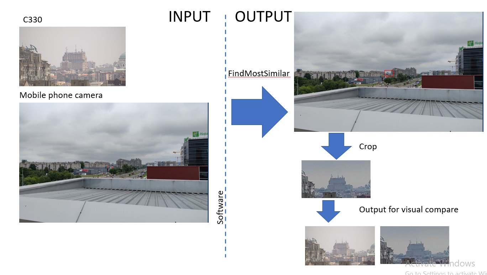

### Computer Vision in Machine Learning - algorithm for identifying template on original picture:

**Recognizing templates** in a set of images (applying computer vision in machine learning); 

**template2** - set of templates which are present at original pictures and can vary in size. 

**slike2** - original pictures

Given the characteristics of this dataset, different methods were used for template recognition (*TM_CCOEFF_NORMED, TM_SQDIFF_NORMED*), 
calculating the mean pixel values across RGB and grayscale colorspaces, using **cumulative pixel distribution by values** to eliminate false positive solutions. 
Additionally, comparing **cumulative distributions** of template-image pairs normalized by correlation coefficient, 
**applying bilateral filtering**, and sorting results based on a formula **comprising 50% of the template matching method and 50% of the normalized correlation coefficient value in the range [0,1]**.

